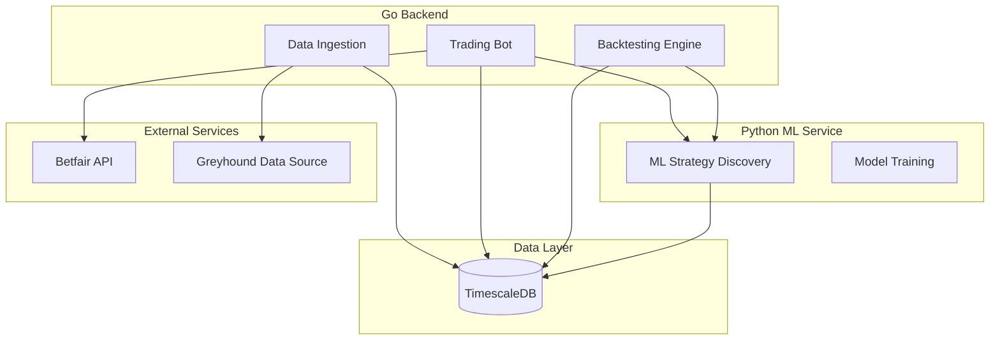

# Clever Better

> An intelligent greyhound racing betting bot with ML-powered strategy discovery

[](https://golang.org)
[](https://python.org)
[](LICENSE)

## Table of Contents

- [Overview](#overview)
- [Features](#features)
- [Architecture](#architecture)
- [Technology Stack](#technology-stack)
- [Prerequisites](#prerequisites)
- [Quick Start](#quick-start)
- [Project Structure](#project-structure)
- [Documentation](#documentation)
- [Development](#development)
- [Deployment](#deployment)
- [Security](#security)
- [Contributing](#contributing)
- [License](#license)
- [Disclaimer](#disclaimer)

## Overview

Clever Better is a sophisticated automated betting system for greyhound racing that combines rigorous backtesting with machine learning-driven strategy discovery. The system integrates with the Betfair Exchange API to execute trades based on statistically validated strategies.

The core philosophy is **data-driven decision making**: historical data feeds backtesting, backtesting results inform ML model training, and ML predictions guide live trading decisions—all with robust risk management controls.

## Features

- **Automated Trading Bot** - Execute bets on Betfair Exchange with configurable risk parameters
- **Comprehensive Backtesting** - Historical replay, Monte Carlo simulation, and walk-forward analysis
- **ML Strategy Discovery** - Automated identification of profitable betting patterns using machine learning
- **Time-Series Data Storage** - Optimized data handling with TimescaleDB for historical and real-time data
- **Cloud-Native Deployment** - Production-ready AWS infrastructure using Terraform
- **Real-Time Monitoring** - Metrics, logging, and alerting for operational visibility

## Architecture

The system consists of three main components:



For detailed architecture documentation, see [docs/ARCHITECTURE.md](docs/ARCHITECTURE.md).

## Technology Stack

| Component | Technology | Purpose |
|-----------|------------|---------|
| Backend | Go 1.22+ | Trading bot, backtesting, data ingestion |
| ML Service | Python 3.11+ | Strategy discovery, model training |
| Database | TimescaleDB | Time-series data storage |
| ML Frameworks | TensorFlow, PyTorch, scikit-learn | Model development |
| Infrastructure | Terraform | Infrastructure as Code |
| Cloud | AWS (ECS Fargate, RDS, VPC) | Production deployment |
| API Integration | Betfair Exchange API | Betting execution |

## Prerequisites

- **Go** 1.22 or higher
- **Python** 3.11 or higher
- **PostgreSQL** 15 or higher
- **TimescaleDB** 2.11 or higher
- **Docker** and Docker Compose
- **Terraform** 1.5 or higher (for deployment)
- **golang-migrate** (for database migrations)
- **AWS CLI** configured (for deployment)
- **Betfair Account** with API access enabled

## Quick Start

### 1. Clone the Repository

```bash
git clone https://github.com/yourusername/clever-better.git
cd clever-better
```

### 2. Install Development Tools

```bash
make install-tools
```

### 3. Set Up Configuration

```bash
cp config/config.yaml.example config/config.yaml
# Edit config/config.yaml with your settings
```

### 4. Set Up Database

```bash
# Create database and run migrations
make db-setup

# Verify connection
make db-health-check
```

### 5. Start Local Development Environment

```bash
make docker-up
```

This starts any external services (configured in docker-compose.yml). Database should already be running from step 4.

### 6. Run Tests

```bash
make test
```

### 7. Build the Applications

```bash
make build
```

## Database

The system uses **TimescaleDB**, a time-series optimized PostgreSQL extension.

### Setup

```bash
# Create and initialize database
make db-setup

# Run migrations
make db-migrate-up

# Check status
make db-migrate-status

# Reset (drop and recreate)
make db-reset
```

### Configuration

Database settings in `config/config.yaml`:

```yaml
database:
  host: localhost
  port: 5432
  name: clever_better
  user: postgres
  password: ${DB_PASSWORD}
  max_connections: 25
```

For detailed schema and repository documentation, see [docs/DATABASE.md](docs/DATABASE.md).

## Project Structure

```
clever-better/
├── cmd/                    # Application entry points
│   ├── bot/               # Trading bot executable
│   ├── backtest/          # Backtesting CLI tool
│   └── data-ingestion/    # Data collection service
├── internal/              # Private application code
│   ├── database/          # Database connection and utilities
│   ├── models/            # Domain models
│   ├── repository/        # Data access layer
│   ├── service/           # Business logic
│   ├── strategy/          # Trading strategies
│   └── ...
├── migrations/            # SQL migration files
├── ml-service/            # Python ML service
│   ├── app/              # FastAPI application
│   ├── models/           # ML models
│   └── tests/            # Python tests
├── deployments/           # Deployment configurations
├── docs/                  # Documentation
└── config/                # Configuration templates
│   ├── backtest/          # Backtesting engine
│   ├── betfair/           # Betfair API client
│   ├── bot/               # Bot orchestration
│   ├── config/            # Configuration management
│   ├── database/          # Database connections
│   ├── datasource/        # Data source integrations
│   ├── logger/            # Logging utilities
│   ├── metrics/           # Metrics collection
│   ├── ml/                # ML service client
│   ├── models/            # Domain models
│   ├── repository/        # Data access layer
│   ├── service/           # Business logic services
│   └── strategy/          # Strategy interfaces
├── pkg/                   # Public reusable libraries
├── api/                   # API definitions (OpenAPI, proto)
├── config/                # Configuration templates
├── ml-service/            # Python ML microservice
│   ├── app/              # Python application code
│   ├── models/           # Trained ML models
│   └── tests/            # Python tests
├── terraform/             # Infrastructure as Code
│   ├── modules/          # Reusable Terraform modules
│   └── environments/     # Environment-specific configs
├── migrations/            # Database migration files
├── scripts/               # Build and utility scripts
├── test/                  # Integration and E2E tests
├── docs/                  # Documentation
├── .github/               # GitHub workflows
└── deployments/           # Deployment configurations
```

## Documentation

| Document | Description |
|----------|-------------|
| [Architecture](docs/ARCHITECTURE.md) | System architecture and component design |
| [Infrastructure](docs/INFRASTRUCTURE.md) | AWS infrastructure and deployment topology |
| [Data Flow](docs/DATA_FLOW.md) | Data processing pipeline documentation |
| [ML Strategy](docs/ML_STRATEGY.md) | Machine learning approach and methodology |
| [Backtesting](docs/BACKTESTING.md) | Backtesting methodology and metrics |
| [API Reference](docs/API_REFERENCE.md) | API documentation |
| [Deployment](docs/DEPLOYMENT.md) | Deployment procedures |
| [Security](docs/SECURITY.md) | Security considerations |
| [Development](docs/DEVELOPMENT.md) | Development guidelines |
| [Troubleshooting](docs/TROUBLESHOOTING.md) | Common issues and solutions |

### AI Context Documentation

For AI-assisted development, see the [docs/ai-context/](docs/ai-context/) directory:

- [Project Overview](docs/ai-context/PROJECT_OVERVIEW.md) - High-level summary for AI
- [Component Guide](docs/ai-context/COMPONENT_GUIDE.md) - Component responsibilities
- [Conventions](docs/ai-context/CONVENTIONS.md) - Coding standards and patterns
- [Decision Log](docs/ai-context/DECISION_LOG.md) - Architectural decisions

## Development

### Common Commands

```bash
make help           # Show all available commands
make setup          # Set up development environment
make build          # Build all components
make test           # Run all tests
make lint           # Run linters
make fmt            # Format code
make docker-up      # Start local environment
make docker-down    # Stop local environment
```

### Running Individual Components

```bash
make run-bot              # Run trading bot
make run-backtest         # Run backtesting tool
make run-data-ingestion   # Run data ingestion
make run-ml               # Run ML service
```

See [docs/DEVELOPMENT.md](docs/DEVELOPMENT.md) for detailed development guidelines.

## Deployment

### AWS Deployment

```bash
# Initialize Terraform
make tf-init

# Review changes
make tf-plan

# Apply infrastructure
make tf-apply
```

See [docs/DEPLOYMENT.md](docs/DEPLOYMENT.md) for complete deployment procedures.

## Security

- All secrets are managed via environment variables
- Betfair API credentials use certificate-based authentication
- Database connections use SSL in production
- AWS infrastructure follows security best practices

See [docs/SECURITY.md](docs/SECURITY.md) for security guidelines.

## Contributing

Contributions are welcome! Please read [CONTRIBUTING.md](CONTRIBUTING.md) for guidelines.

## License

This project is licensed under the MIT License - see the [LICENSE](LICENSE) file for details.

## Disclaimer

**IMPORTANT: This software is for educational and research purposes.**

- Gambling involves financial risk. Only bet what you can afford to lose.
- Past performance (including backtesting results) does not guarantee future results.
- The authors are not responsible for any financial losses incurred through use of this software.
- Ensure compliance with local laws and regulations regarding gambling and automated betting.
- This software is not affiliated with or endorsed by Betfair.

Use at your own risk.
