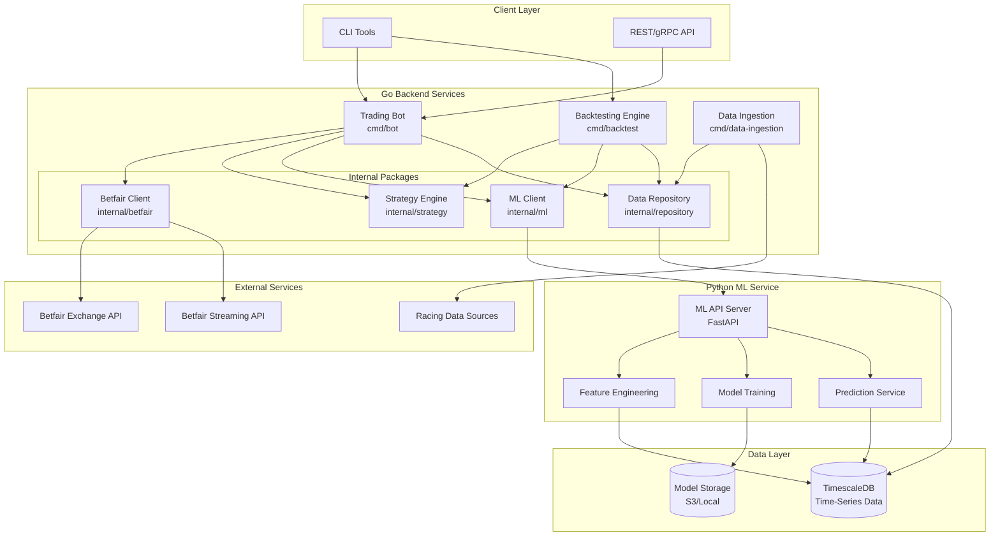

# System Architecture

This document provides a comprehensive overview of the Clever Better system architecture, including component design, interaction patterns, and technology rationale.

## Table of Contents

- [Overview](#overview)
- [System Architecture Diagram](#system-architecture-diagram)
- [Core Components](#core-components)
- [Component Interactions](#component-interactions)
- [Technology Stack Rationale](#technology-stack-rationale)
- [Data Architecture](#data-architecture)
- [Scalability Considerations](#scalability-considerations)

## Overview

Clever Better is designed as a modular, microservices-inspired architecture with clear separation of concerns:

- **Go Backend**: Handles all trading operations, backtesting, and data ingestion
- **Python ML Service**: Dedicated to machine learning model training and inference
- **TimescaleDB**: Optimized time-series database for historical and real-time data
- **External Integrations**: Betfair API and greyhound racing data sources

## System Architecture Diagram

## Core Components

### Trading Bot (`cmd/bot`)

The main application responsible for live trading operations.

**Responsibilities:**
- Connect to Betfair Exchange API
- Subscribe to market streaming data
- Request predictions from ML service
- Execute betting strategies with risk management
- Log all trading activity

**Key Internal Dependencies:**
- `internal/betfair` - Betfair API client
- `internal/strategy` - Strategy execution engine
- `internal/ml` - ML service client
- `internal/config` - Configuration management
- `internal/metrics` - Performance metrics

### Backtesting Engine (`cmd/backtest`)

CLI tool for historical strategy validation.

**Responsibilities:**
- Load historical race and odds data
- Simulate trading strategies against historical data
- Run Monte Carlo simulations for risk analysis
- Perform walk-forward optimization
- Generate performance reports

**Key Internal Dependencies:**
- `internal/backtest` - Core backtesting logic
- `internal/strategy` - Strategy interfaces
- `internal/repository` - Historical data access

### Data Ingestion Service (`cmd/data-ingestion`)

Service for collecting and storing racing data.

**Responsibilities:**
- Fetch historical race results
- Collect greyhound form data
- Store odds snapshots
- Maintain data quality and consistency

**Key Internal Dependencies:**
- `internal/datasource` - External data source clients
- `internal/repository` - Data persistence

### ML Service (`ml-service/`)

Python microservice for machine learning operations.

**Responsibilities:**
- Feature engineering from raw data
- Model training and validation
- Real-time prediction serving
- Model versioning and management

**Technology Stack:**
- FastAPI for HTTP/gRPC API
- TensorFlow/PyTorch for deep learning
- scikit-learn for classical ML
- pandas/numpy for data processing

## Component Interactions

### Live Trading Flow

### Backtesting Flow

## Technology Stack Rationale

### Why Go for Backend?

- **Performance**: Low latency critical for live trading
- **Concurrency**: Goroutines ideal for handling multiple market streams
- **Type Safety**: Compile-time checks reduce runtime errors
- **Single Binary**: Easy deployment without runtime dependencies
- **Strong Standard Library**: Excellent HTTP, JSON, and networking support

### Why Python for ML?

- **ML Ecosystem**: TensorFlow, PyTorch, scikit-learn mature and well-supported
- **Data Science Tools**: pandas, numpy, matplotlib industry standard
- **Rapid Prototyping**: Quick iteration on model experiments
- **Research Compatibility**: Easy to incorporate academic research

### Why TimescaleDB?

- **Time-Series Optimization**: Purpose-built for time-series data
- **PostgreSQL Compatibility**: Familiar SQL interface, rich ecosystem
- **Compression**: Efficient storage for large historical datasets
- **Continuous Aggregates**: Pre-computed rollups for fast queries
- **Retention Policies**: Automatic data lifecycle management

### Why gRPC for Go-Python Communication?

- **Performance**: Binary protocol faster than JSON/REST
- **Type Safety**: Protobuf schemas ensure contract compliance
- **Streaming**: Native support for bidirectional streaming
- **Code Generation**: Auto-generated clients reduce boilerplate

## Data Architecture

### Core Data Entities

### Data Partitioning Strategy

TimescaleDB hypertables partition data by time:

- **OddsSnapshot**: Partitioned by week, retained for 2 years
- **Trade**: Partitioned by month, retained indefinitely
- **Prediction**: Partitioned by day, retained for 6 months

## Scalability Considerations

### Horizontal Scaling

- **Trading Bot**: Single instance per Betfair account (API limits)
- **ML Service**: Can scale horizontally behind load balancer
- **Data Ingestion**: Can parallelize by data source

### Performance Optimizations

- **Connection Pooling**: Database connection pools sized for workload
- **Caching**: Redis layer for frequently accessed reference data
- **Async Processing**: Non-critical operations processed asynchronously
- **Batch Queries**: Bulk inserts for high-volume data ingestion

### Monitoring Points

- API latency percentiles (p50, p95, p99)
- ML inference time
- Database query performance
- Market data lag
- Trade execution success rate
