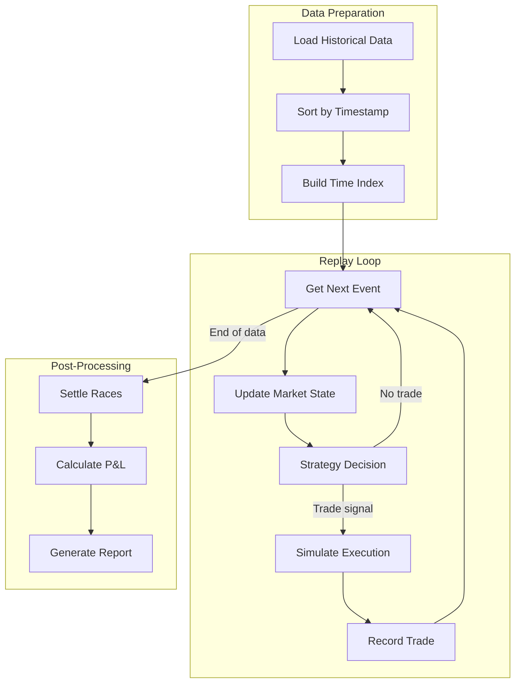
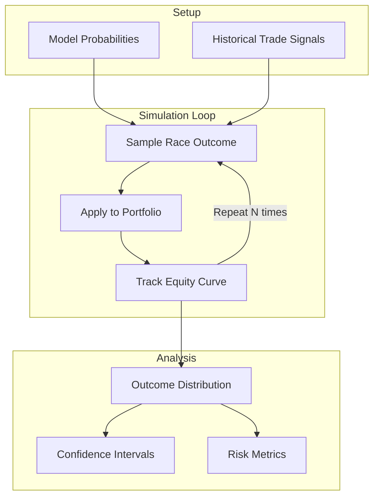
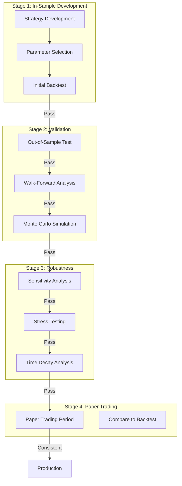

# Backtesting Methodology

This document describes the backtesting approach used in Clever Better, including simulation methods, performance metrics, and validation procedures.

## Table of Contents

- [Overview](#overview)
- [Backtesting Philosophy](#backtesting-philosophy)
- [Simulation Methods](#simulation-methods)
- [Performance Metrics](#performance-metrics)
- [Strategy Validation](#strategy-validation)
- [Common Pitfalls](#common-pitfalls)
- [Reporting](#reporting)

## Overview

Backtesting is the process of evaluating trading strategies using historical data. It serves three critical purposes:

1. **Strategy Validation**: Verify that a strategy would have been profitable historically
2. **Parameter Optimization**: Find optimal strategy parameters
3. **Risk Assessment**: Understand potential drawdowns and tail risks

## Backtesting Philosophy

### Principles

1. **Conservatism**: Always assume worst-case execution
2. **Realism**: Model transaction costs, slippage, and liquidity
3. **No Lookahead**: Strictly use only information available at decision time
4. **Out-of-Sample Testing**: Reserve data for final validation

### Information Timeline

```
Decision Point: T
├── Available Information:
│   ├── Historical race results (< T)
│   ├── Form data (< T)
│   ├── Current odds at T
│   └── Market volume at T
│
└── NOT Available (future leakage):
    ├── Race result
    ├── Final odds
    └── Future odds movements
```

## Simulation Methods

### 1. Historical Replay

The primary backtesting method replays historical data chronologically.



**Configuration:**
```yaml
backtest:
  type: historical_replay
  start_date: "2023-01-01"
  end_date: "2024-01-01"
  initial_capital: 10000.00
  commission_rate: 0.02  # 2% Betfair commission
  min_liquidity: 100.00  # Minimum matched volume
```

### 2. Monte Carlo Simulation

Monte Carlo simulation estimates the distribution of outcomes by randomizing race results according to predicted probabilities.



**Use Cases:**
- Estimate confidence intervals for expected returns
- Calculate probability of ruin
- Assess tail risk (worst-case scenarios)

**Implementation:**
```python
def monte_carlo_backtest(trades, model_probabilities, n_simulations=10000):
    results = []

    for _ in range(n_simulations):
        portfolio_value = INITIAL_CAPITAL

        for trade in trades:
            # Sample outcome based on model probability
            prob = model_probabilities[trade.race_id][trade.runner_id]
            won = np.random.random() < prob

            if won:
                profit = trade.stake * (trade.odds - 1) * (1 - COMMISSION)
            else:
                profit = -trade.stake

            portfolio_value += profit

        results.append(portfolio_value)

    return {
        'mean': np.mean(results),
        'std': np.std(results),
        'var_95': np.percentile(results, 5),
        'var_99': np.percentile(results, 1),
        'prob_profit': np.mean(np.array(results) > INITIAL_CAPITAL)
    }
```

### 3. Walk-Forward Analysis

Walk-forward analysis prevents overfitting by testing on truly out-of-sample data.

```
Timeline:
|═══════════════════════════════════════════════════════════════|

Window 1:
|████████ Train ████████|▒▒ Val ▒▒|░░ Test ░░|
                                             ↓
                                        Record results

Window 2:
         |████████ Train ████████|▒▒ Val ▒▒|░░ Test ░░|
                                                      ↓
                                                 Record results

Window 3:
                  |████████ Train ████████|▒▒ Val ▒▒|░░ Test ░░|
                                                               ↓
                                                          Record results

Final Results = Concatenate all test period results
```

**Configuration:**
```yaml
walk_forward:
  training_window: 180  # days
  validation_window: 30  # days
  test_window: 30  # days
  step_size: 30  # days between windows
  min_trades_per_window: 100
```

## Performance Metrics

### Return Metrics

| Metric | Formula | Description |
|--------|---------|-------------|
| **ROI** | (Final - Initial) / Initial | Total return on investment |
| **Annualized Return** | (1 + ROI)^(365/days) - 1 | Return scaled to yearly basis |
| **Average Bet Return** | Total P&L / Number of Bets | Average profit per bet |

### Risk Metrics

| Metric | Formula | Description |
|--------|---------|-------------|
| **Max Drawdown** | max(peak - trough) / peak | Largest decline from peak |
| **Sharpe Ratio** | (Return - Rf) / Std(Returns) | Risk-adjusted return |
| **Sortino Ratio** | (Return - Rf) / Downside Std | Downside risk-adjusted return |
| **Calmar Ratio** | Annualized Return / Max Drawdown | Return per unit drawdown |

### Trading Metrics

| Metric | Formula | Description |
|--------|---------|-------------|
| **Win Rate** | Winning Bets / Total Bets | Percentage of profitable bets |
| **Profit Factor** | Gross Profit / Gross Loss | Ratio of wins to losses |
| **Average Win** | Sum(Winning P&L) / Winning Bets | Average winning bet size |
| **Average Loss** | Sum(Losing P&L) / Losing Bets | Average losing bet size |
| **Expectancy** | (Win% × Avg Win) - (Loss% × Avg Loss) | Expected value per bet |

### Example Metrics Calculation

```python
@dataclass
class BacktestMetrics:
    total_trades: int
    winning_trades: int
    losing_trades: int
    gross_profit: float
    gross_loss: float
    net_profit: float
    max_drawdown: float
    sharpe_ratio: float

    @property
    def win_rate(self) -> float:
        return self.winning_trades / self.total_trades if self.total_trades > 0 else 0

    @property
    def profit_factor(self) -> float:
        return self.gross_profit / abs(self.gross_loss) if self.gross_loss != 0 else float('inf')

    @property
    def roi(self) -> float:
        return self.net_profit / INITIAL_CAPITAL

    @property
    def expectancy(self) -> float:
        avg_win = self.gross_profit / self.winning_trades if self.winning_trades > 0 else 0
        avg_loss = abs(self.gross_loss) / self.losing_trades if self.losing_trades > 0 else 0
        return (self.win_rate * avg_win) - ((1 - self.win_rate) * avg_loss)
```

## Strategy Validation

### Multi-Stage Validation Process



### Validation Criteria

A strategy must meet ALL criteria to pass validation:

| Criterion | Threshold | Rationale |
|-----------|-----------|-----------|
| Out-of-sample ROI | > 0% | Must be profitable on unseen data |
| Walk-forward consistency | > 60% profitable windows | Not reliant on specific periods |
| Monte Carlo VaR (95%) | > -20% | Acceptable worst-case scenarios |
| Sharpe Ratio | > 0.5 | Risk-adjusted returns positive |
| Minimum trades | > 500 | Statistically significant sample |
| Win rate | > 30% | Not overly dependent on home runs |

### Sensitivity Analysis

Test strategy robustness to parameter variations:

```python
def sensitivity_analysis(strategy, param_name, param_range):
    """
    Test strategy performance across parameter range.
    Strategy is robust if performance degrades gracefully.
    """
    results = []

    for value in param_range:
        modified_strategy = strategy.with_param(param_name, value)
        backtest_result = run_backtest(modified_strategy)
        results.append({
            'param_value': value,
            'roi': backtest_result.roi,
            'sharpe': backtest_result.sharpe_ratio
        })

    # Check for cliff edges (sudden performance drops)
    roi_values = [r['roi'] for r in results]
    max_drop = max(roi_values) - min(roi_values)

    return {
        'results': results,
        'max_drop': max_drop,
        'is_robust': max_drop < 0.1  # Less than 10% variation
    }
```

## Common Pitfalls

### 1. Lookahead Bias

**Problem**: Using future information in decisions.

**Examples:**
- Using final race odds (not available pre-race)
- Using race result to filter training data
- Using today's form data for yesterday's prediction

**Prevention:**
- Strict timestamp checks on all data access
- Code review for temporal logic
- Unit tests with synthetic data

### 2. Survivorship Bias

**Problem**: Only analyzing data that "survived" to present.

**Examples:**
- Missing data for tracks that closed
- Missing dogs that were retired mid-career

**Prevention:**
- Use point-in-time data snapshots
- Include all historical entities

### 3. Overfitting

**Problem**: Strategy fits noise in training data.

**Symptoms:**
- Excellent in-sample, poor out-of-sample
- Many parameters relative to data points
- Strategy doesn't generalize across time periods

**Prevention:**
- Walk-forward validation
- Limit number of parameters
- Require minimum trade counts

### 4. Transaction Cost Underestimation

**Problem**: Ignoring real-world execution costs.

**Costs to model:**
- Betfair commission (2-5%)
- Spread (back-lay difference)
- Slippage (price movement during execution)
- Market impact (large bets move prices)

**Implementation:**
```python
def apply_transaction_costs(trade, execution_price):
    """Apply realistic transaction cost model."""
    # Commission
    commission = trade.profit * COMMISSION_RATE if trade.profit > 0 else 0

    # Slippage (assume 0.5 tick worse execution)
    slippage = trade.stake * 0.005

    # Market impact for large bets
    if trade.stake > LARGE_BET_THRESHOLD:
        impact = trade.stake * 0.01
    else:
        impact = 0

    return trade.profit - commission - slippage - impact
```

## Reporting

### Backtest Report Structure

```
═══════════════════════════════════════════════════════════════
                    BACKTEST REPORT
═══════════════════════════════════════════════════════════════

Strategy: ML Ensemble v2.1
Period: 2023-01-01 to 2024-01-01
Initial Capital: £10,000

───────────────────────────────────────────────────────────────
                    PERFORMANCE SUMMARY
───────────────────────────────────────────────────────────────

Total Return:        £1,234.56 (+12.35%)
Annualized Return:   12.35%
Sharpe Ratio:        1.42
Max Drawdown:        -8.23%
Calmar Ratio:        1.50

───────────────────────────────────────────────────────────────
                    TRADING STATISTICS
───────────────────────────────────────────────────────────────

Total Trades:        1,847
Win Rate:            38.2%
Profit Factor:       1.31
Average Win:         £14.23
Average Loss:        £8.67
Largest Win:         £156.00
Largest Loss:        £45.00

───────────────────────────────────────────────────────────────
                    MONTHLY BREAKDOWN
───────────────────────────────────────────────────────────────

Month      Trades   Win%    P&L       Cum P&L
────────   ──────   ────    ──────    ──────
Jan 2023   142      36.6%   +£78      £78
Feb 2023   138      41.3%   +£134     £212
Mar 2023   156      35.9%   +£45      £257
...

───────────────────────────────────────────────────────────────
                    RISK ANALYSIS
───────────────────────────────────────────────────────────────

Value at Risk (95%):     -£432
Expected Shortfall:      -£567
Probability of Ruin:     0.2%
Recovery Factor:         1.50

═══════════════════════════════════════════════════════════════
```

### Equity Curve Visualization

The backtest report includes an equity curve chart showing:
- Portfolio value over time
- Drawdown periods highlighted
- Benchmark comparison (if applicable)
- Confidence bands from Monte Carlo simulation
