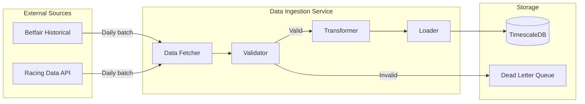
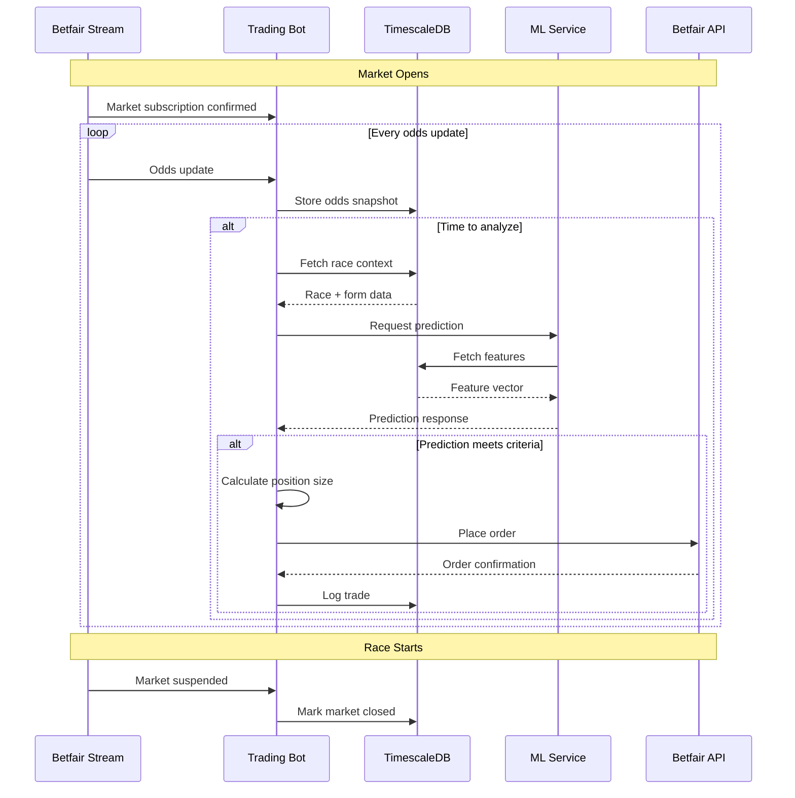
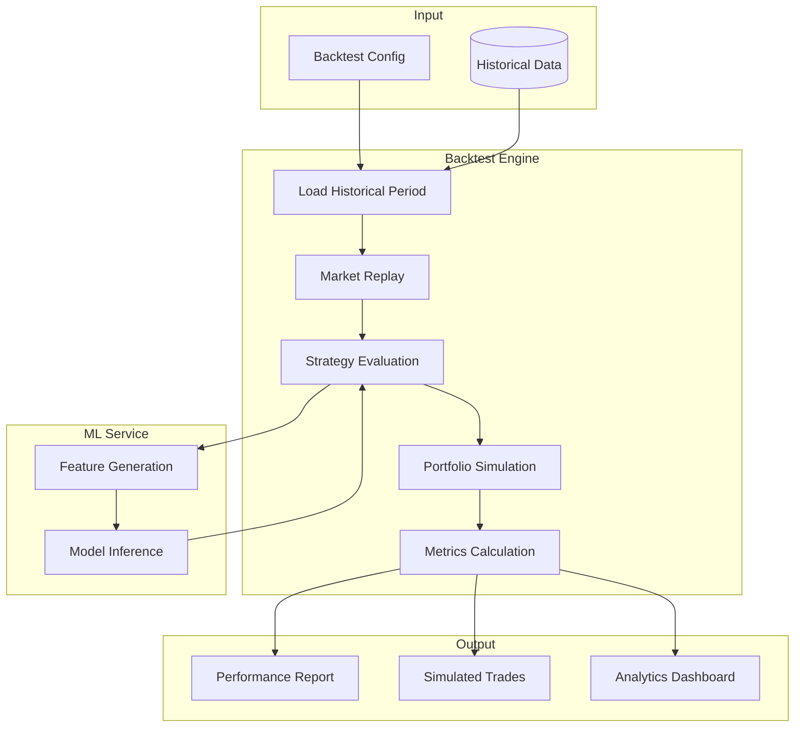
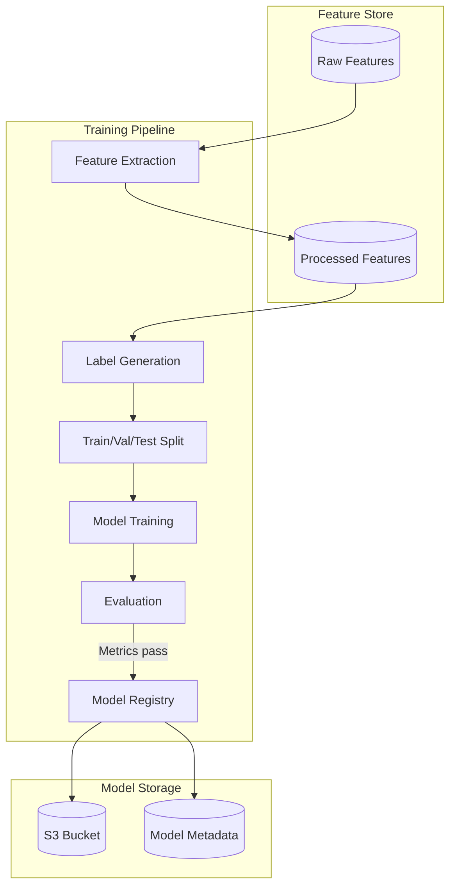

# Data Flow Documentation

This document describes the data processing pipelines in Clever Better, including ingestion, transformation, storage, and consumption patterns.

## Table of Contents

- [Overview](#overview)
- [Data Sources](#data-sources)
- [Data Ingestion Pipeline](#data-ingestion-pipeline)
- [Live Trading Data Flow](#live-trading-data-flow)
- [Backtesting Data Flow](#backtesting-data-flow)
- [ML Training Pipeline](#ml-training-pipeline)
- [Data Retention and Archival](#data-retention-and-archival)

## Overview

Data flows through the system in several distinct pipelines:

1. **Ingestion Pipeline**: External data → TimescaleDB
2. **Trading Pipeline**: Market data → Predictions → Trade execution
3. **Backtesting Pipeline**: Historical data → Simulated trades → Reports
4. **ML Pipeline**: Features → Training → Model artifacts

## Data Sources

### External Data Sources

| Source | Data Type | Frequency | Method |
|--------|-----------|-----------|--------|
| Betfair Historical | Past race results, odds | Daily | Batch download |
| Betfair Streaming | Live odds, market status | Real-time | WebSocket |
| Racing Data Provider | Form data, track conditions | Daily | REST API |

### Internal Data Sources

| Source | Data Type | Generated By |
|--------|-----------|--------------|
| Trade Log | Execution records | Trading Bot |
| Predictions | ML outputs | ML Service |
| Backtest Results | Performance metrics | Backtest Engine |

## Data Ingestion Pipeline



### Ingestion Process

1. **Fetch**: Download data from external sources
   - Betfair: Historical data files (tar.bz2 archives)
   - Racing API: JSON responses via REST

2. **Validate**: Ensure data quality
   - Schema validation
   - Required field checks
   - Range validation (e.g., odds > 1.0)
   - Duplicate detection

3. **Transform**: Normalize and enrich data
   - Convert timestamps to UTC
   - Calculate derived fields
   - Map external IDs to internal IDs

4. **Load**: Persist to TimescaleDB
   - Batch inserts for efficiency
   - Upsert to handle re-processing
   - Partition by time automatically

### Data Validation Rules

```go
type ValidationRules struct {
    Race struct {
        ScheduledStart  time.Time  // Must be in past (historical) or future (upcoming)
        Track           string     // Must exist in track registry
        RunnerCount     int        // Must be 6-8 for greyhounds
    }
    Odds struct {
        BackPrice       float64    // Must be >= 1.01
        LayPrice        float64    // Must be >= BackPrice
        Volume          float64    // Must be >= 0
    }
}
```

## Live Trading Data Flow



### Odds Snapshot Schema

```sql
CREATE TABLE odds_snapshots (
    time        TIMESTAMPTZ NOT NULL,
    race_id     UUID NOT NULL,
    runner_id   UUID NOT NULL,
    back_price  DECIMAL(10,2),
    back_size   DECIMAL(12,2),
    lay_price   DECIMAL(10,2),
    lay_size    DECIMAL(12,2),
    ltp         DECIMAL(10,2),  -- Last traded price
    tv          DECIMAL(14,2),  -- Total volume
    PRIMARY KEY (time, race_id, runner_id)
);

SELECT create_hypertable('odds_snapshots', 'time');
```

## Backtesting Data Flow



### Backtest Execution Flow

1. **Configuration**: Define backtest parameters
   - Date range
   - Initial capital
   - Strategy parameters
   - Risk limits

2. **Data Loading**: Fetch historical data for period
   - Race metadata
   - Odds time-series
   - Results

3. **Market Replay**: Simulate market chronologically
   - Play back odds at recorded timestamps
   - Respect information boundaries (no lookahead)

4. **Strategy Evaluation**: At each decision point
   - Generate features from available data
   - Request ML prediction
   - Apply strategy logic

5. **Portfolio Simulation**: Track virtual portfolio
   - Execute virtual trades at historical prices
   - Apply commission model
   - Track P&L over time

6. **Metrics Calculation**: Compute performance statistics
   - Total return, Sharpe ratio, max drawdown
   - Win rate, average win/loss
   - Profit factor

## ML Training Pipeline



### Feature Generation

Features are generated from multiple data sources:

**Race Features:**
- Track characteristics (distance, grade)
- Time of day, day of week
- Weather conditions
- Field size

**Runner Features:**
- Recent form (last 5 races)
- Track/distance record
- Trap statistics
- Days since last race

**Market Features:**
- Current odds vs. opening odds
- Odds movement velocity
- Market volume
- Price/volume divergence

### Label Definition

```python
def generate_label(race_result, runner_id):
    """
    Generate training label for a runner.

    Labels:
    - WIN: 1 if runner won, 0 otherwise
    - PLACE: 1 if runner finished 1st-3rd, 0 otherwise
    - VALUE: 1 if backing at current odds was +EV, 0 otherwise
    """
    runner_position = race_result.get_position(runner_id)

    return {
        'win': 1 if runner_position == 1 else 0,
        'place': 1 if runner_position <= 3 else 0,
        'value': calculate_ev_label(race_result, runner_id)
    }
```

## Data Retention and Archival

### Retention Policies

| Data Type | Hot Storage | Warm Storage | Cold Storage |
|-----------|-------------|--------------|--------------|
| Odds Snapshots | 30 days | 1 year | 5 years |
| Trades | 1 year | 5 years | Indefinite |
| Predictions | 7 days | 90 days | 1 year |
| ML Features | 90 days | 1 year | 2 years |
| Backtest Results | 30 days | 1 year | 2 years |

### TimescaleDB Retention Policy

```sql
-- Automatically drop old odds data
SELECT add_retention_policy('odds_snapshots', INTERVAL '2 years');

-- Compress data older than 7 days
SELECT add_compression_policy('odds_snapshots', INTERVAL '7 days');
```

### Archival Process

1. **Continuous Aggregates**: Pre-computed rollups for historical queries
2. **Compression**: TimescaleDB native compression for older data
3. **S3 Export**: Monthly exports to S3 for long-term storage
4. **Lifecycle Policies**: Automatic transition to S3 Glacier after 2 years
