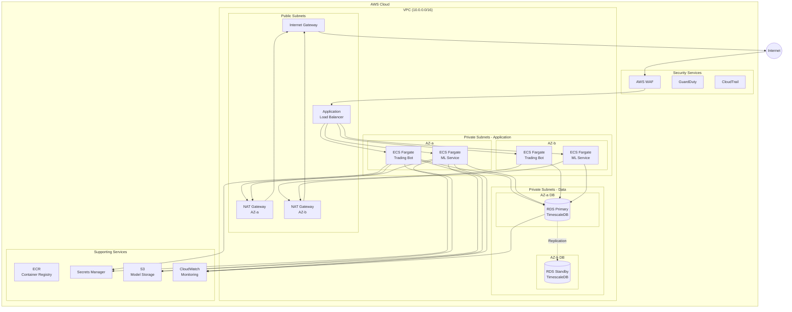

# Infrastructure Documentation

This document describes the AWS infrastructure architecture for Clever Better, including network topology, security design, and operational considerations.

## Table of Contents

- [Overview](#overview)
- [Infrastructure Diagram](#infrastructure-diagram)
- [Network Architecture](#network-architecture)
- [Compute Resources](#compute-resources)
- [Database Infrastructure](#database-infrastructure)
- [Security Architecture](#security-architecture)
- [Monitoring and Logging](#monitoring-and-logging)
- [Disaster Recovery](#disaster-recovery)
- [Cost Optimization](#cost-optimization)

## Overview

The infrastructure is designed with the following principles:

- **Security First**: Defense in depth with multiple security layers
- **High Availability**: Multi-AZ deployment for critical components
- **Cost Efficiency**: Right-sized resources with auto-scaling
- **Operational Excellence**: Comprehensive monitoring and automation

## Infrastructure Diagram



## Network Architecture

### VPC Design

| Component | CIDR | Purpose |
|-----------|------|---------|
| VPC | 10.0.0.0/16 | Main VPC with 65,536 IPs |
| Public Subnet A | 10.0.1.0/24 | NAT Gateway, ALB (AZ-a) |
| Public Subnet B | 10.0.2.0/24 | NAT Gateway, ALB (AZ-b) |
| Private App Subnet A | 10.0.10.0/24 | ECS Tasks (AZ-a) |
| Private App Subnet B | 10.0.11.0/24 | ECS Tasks (AZ-b) |
| Private Data Subnet A | 10.0.20.0/24 | RDS Primary (AZ-a) |
| Private Data Subnet B | 10.0.21.0/24 | RDS Standby (AZ-b) |

### Network Flow

1. **Inbound Traffic**: Internet → WAF → ALB → Private Subnets
2. **Outbound Traffic**: ECS Tasks → NAT Gateway → Internet Gateway → Internet
3. **Database Traffic**: Application Subnets → Data Subnets (internal only)

### Security Groups

| Security Group | Inbound | Outbound | Purpose |
|---------------|---------|----------|---------|
| ALB-SG | 443 (HTTPS) | App-SG:8000 | Load balancer |
| App-SG | 8000 from ALB-SG | All (via NAT) | Application tier |
| DB-SG | 5432 from App-SG | None | Database tier |

## Compute Resources

### ECS Fargate Configuration

**Trading Bot Service:**
```hcl
cpu    = 512   # 0.5 vCPU
memory = 1024  # 1 GB
desired_count = 1  # Single instance per Betfair account

health_check {
  path     = "/health"
  interval = 30
}
```

**ML Service:**
```hcl
cpu    = 2048  # 2 vCPU
memory = 4096  # 4 GB
desired_count = 2  # Minimum 2 for HA

auto_scaling {
  min_capacity = 2
  max_capacity = 10
  target_cpu   = 70
}
```

### Container Registry (ECR)

- **clever-better-bot**: Trading bot image
- **clever-better-ml**: ML service image
- **Image Scanning**: Enabled for vulnerability detection
- **Lifecycle Policy**: Keep last 10 images per repository

## Database Infrastructure

### RDS TimescaleDB Configuration

```hcl
instance_class        = "db.r6g.large"
allocated_storage     = 100  # GB
max_allocated_storage = 500  # GB (auto-scaling)
multi_az             = true
storage_encrypted    = true

backup {
  retention_period = 30
  window          = "03:00-04:00"
}

maintenance_window = "Mon:04:00-Mon:05:00"
```

### Database Performance Tuning

Key TimescaleDB parameters:
```sql
-- Connection pooling
max_connections = 200

-- Memory settings
shared_buffers = 4GB
effective_cache_size = 12GB
work_mem = 64MB

-- TimescaleDB specific
timescaledb.max_background_workers = 8
```

## Security Architecture

### IAM Roles

**ECS Task Role:**
```json
{
  "Effect": "Allow",
  "Action": [
    "secretsmanager:GetSecretValue",
    "s3:GetObject",
    "s3:PutObject",
    "logs:CreateLogStream",
    "logs:PutLogEvents"
  ],
  "Resource": ["arn:aws:..."]
}
```

### Secrets Management

All secrets stored in AWS Secrets Manager:
- `clever-better/prod/database` - DB credentials
- `clever-better/prod/betfair` - Betfair API credentials
- `clever-better/prod/api-keys` - Internal API keys

### Encryption

- **At Rest**: RDS encryption with AWS KMS
- **In Transit**: TLS 1.3 for all connections
- **S3**: Server-side encryption (SSE-S3)

### Compliance Controls

- **CloudTrail**: API audit logging enabled
- **GuardDuty**: Threat detection enabled
- **Config Rules**: Compliance monitoring
- **VPC Flow Logs**: Network traffic logging

## Monitoring and Logging

### CloudWatch Metrics

**Application Metrics:**
- `TradeExecutionLatency` - Time to execute trades
- `MLInferenceTime` - ML prediction latency
- `BetfairAPIErrors` - API error rate
- `ActiveMarkets` - Number of monitored markets

**Infrastructure Metrics:**
- CPU/Memory utilization
- Network throughput
- Database connections
- ALB request count/latency

### Alarms

| Alarm | Threshold | Action |
|-------|-----------|--------|
| High CPU | > 80% for 5 min | SNS notification |
| High Memory | > 85% for 5 min | SNS notification |
| DB Connections | > 80% of max | SNS notification |
| API Errors | > 10/min | SNS + PagerDuty |
| Trade Failures | > 3/hour | PagerDuty |

### Log Aggregation

All logs centralized in CloudWatch Logs:
- `/ecs/clever-better-bot`
- `/ecs/clever-better-ml`
- `/rds/clever-better`

Log retention: 90 days (then archived to S3)

## Disaster Recovery

### RTO/RPO Targets

| Component | RTO | RPO |
|-----------|-----|-----|
| Trading Bot | 5 min | N/A (stateless) |
| ML Service | 5 min | N/A (stateless) |
| Database | 15 min | 5 min |
| ML Models | 30 min | 24 hours |

### Backup Strategy

- **RDS**: Automated daily backups + continuous WAL archiving
- **S3 Models**: Cross-region replication to backup region
- **Configuration**: Terraform state in S3 with versioning

### Failover Procedures

1. **Database Failover**: Automatic Multi-AZ failover
2. **Application Failover**: ALB health checks route to healthy tasks
3. **Region Failover**: Manual procedure documented in runbook

## Cost Optimization

### Estimated Monthly Costs

| Resource | Configuration | Est. Cost |
|----------|---------------|-----------|
| ECS Fargate | Bot + ML services | $150 |
| RDS | db.r6g.large Multi-AZ | $350 |
| NAT Gateway | 2 x NAT Gateway | $70 |
| ALB | Application Load Balancer | $25 |
| S3 | 50 GB storage | $5 |
| CloudWatch | Logs + Metrics | $30 |
| **Total** | | **~$630/month** |

### Cost Saving Opportunities

- **Savings Plans**: Commit to 1-year compute for 30% savings
- **Reserved Instances**: RDS reserved for 40% savings
- **Right-sizing**: Monitor and adjust based on actual usage
- **Spot Instances**: Consider for backtesting workloads
