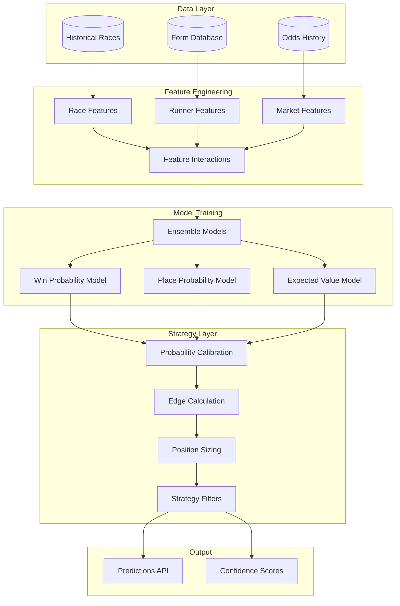
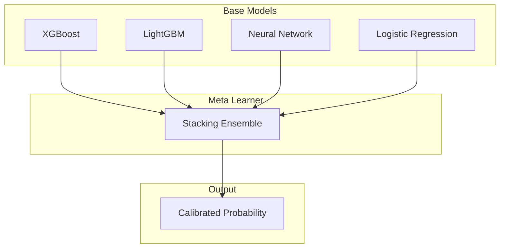
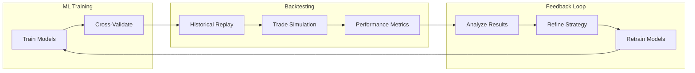
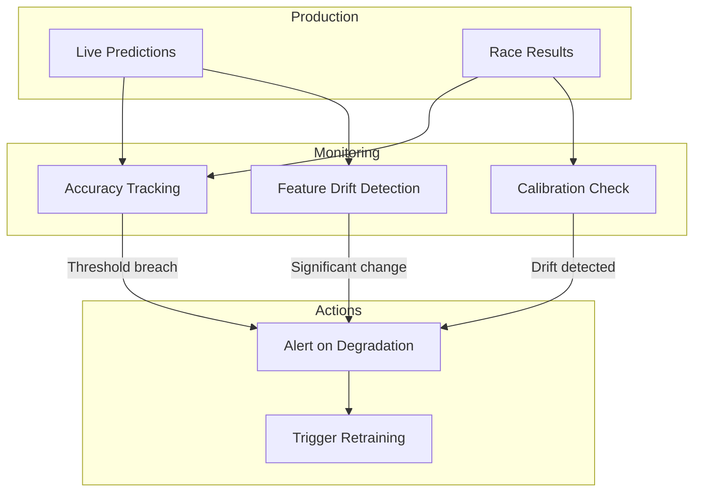

# ML Strategy Discovery

This document describes the machine learning approach used for strategy discovery in Clever Better, including the methodology for identifying profitable betting patterns and the critical connection between backtesting and ML.

## Table of Contents

- [Overview](#overview)
- [Strategy Discovery Philosophy](#strategy-discovery-philosophy)
- [ML Pipeline Architecture](#ml-pipeline-architecture)
- [Feature Engineering](#feature-engineering)
- [Model Selection](#model-selection)
- [Backtesting-ML Integration](#backtesting-ml-integration)
- [Strategy Evaluation](#strategy-evaluation)
- [Continuous Learning](#continuous-learning)

## Overview

The ML component serves as a **strategy discovery engine**, not just a prediction model. The goal is to identify systematic edges in greyhound racing markets that can be exploited for profit.

Key principles:
- **Data-driven**: All strategies backed by statistical evidence
- **Robust**: Strategies must survive out-of-sample testing
- **Risk-adjusted**: Optimize for risk-adjusted returns, not just raw returns
- **Adaptive**: Continuously learn from new market data

## Strategy Discovery Philosophy

### The Prediction Problem

Traditional betting approaches focus on predicting race outcomes. Our approach is different:

```
Traditional: "Which dog will win?"
Our approach: "Where are the odds mispriced?"
```

The goal is not to predict winners perfectly, but to identify situations where the market odds don't accurately reflect true probabilities.

### Expected Value Framework

A bet has positive expected value when:

```
EV = (Probability × Odds) - 1 > 0
```

For a back bet at odds of 4.0, if true probability is 30%:
```
EV = (0.30 × 4.0) - 1 = 0.20 (20% edge)
```

The ML model's job is to estimate true probabilities more accurately than the market.

## ML Pipeline Architecture



## Feature Engineering

### Race-Level Features

| Feature | Description | Rationale |
|---------|-------------|-----------|
| `track_id` | Track identifier (categorical) | Track-specific patterns |
| `distance` | Race distance in meters | Trap bias varies by distance |
| `grade` | Race grade (A1-A11, etc.) | Class effects on predictability |
| `time_of_day` | Bucketed time | Evening vs afternoon patterns |
| `day_of_week` | Day of week | Weekend vs weekday patterns |
| `field_size` | Number of runners | Impact on odds distribution |
| `prize_money` | Race prize pool | Quality indicator |

### Runner-Level Features

| Feature | Description | Rationale |
|---------|-------------|-----------|
| `trap_number` | Trap position (1-6/8) | Known trap bias effect |
| `recent_form` | Encoded last 5 results | Recent performance |
| `win_rate_track` | Win rate at this track | Track specialist effect |
| `win_rate_distance` | Win rate at this distance | Distance preference |
| `days_since_race` | Rest days | Freshness factor |
| `avg_early_speed` | Average sectional times | Running style |
| `consistency_score` | Variance in finishing positions | Reliability metric |
| `trainer_form` | Trainer recent performance | Trainer effect |
| `weight_change` | Weight vs last race | Fitness indicator |

### Market-Level Features

| Feature | Description | Rationale |
|---------|-------------|-----------|
| `current_odds` | Latest back price | Market assessment |
| `opening_odds` | First available price | Market anchor |
| `odds_drift` | (current - opening) / opening | Market sentiment shift |
| `odds_velocity` | Rate of odds change | Smart money indicator |
| `market_volume` | Total matched volume | Liquidity/confidence |
| `volume_weighted_price` | VWAP of matched bets | True market price |
| `odds_rank` | Odds rank in field | Relative market view |

### Feature Interactions

```python
# Example feature interactions
features['odds_vs_form'] = features['current_odds'] / (features['recent_win_rate'] + 0.01)
features['trap_grade_interaction'] = features['trap_number'] * features['grade_numeric']
features['speed_consistency'] = features['avg_early_speed'] * features['consistency_score']
```

## Model Selection

### Model Architecture

We use an ensemble approach combining multiple model types:



### Model Specifications

**XGBoost Configuration:**
```python
xgb_params = {
    'objective': 'binary:logistic',
    'max_depth': 6,
    'learning_rate': 0.05,
    'n_estimators': 500,
    'subsample': 0.8,
    'colsample_bytree': 0.8,
    'min_child_weight': 3,
    'reg_alpha': 0.1,
    'reg_lambda': 1.0
}
```

**Neural Network Architecture:**
```python
model = Sequential([
    Dense(128, activation='relu', input_shape=(n_features,)),
    BatchNormalization(),
    Dropout(0.3),
    Dense(64, activation='relu'),
    BatchNormalization(),
    Dropout(0.2),
    Dense(32, activation='relu'),
    Dense(1, activation='sigmoid')
])
```

### Probability Calibration

Raw model outputs are calibrated using isotonic regression:

```python
from sklearn.calibration import CalibratedClassifierCV

calibrated_model = CalibratedClassifierCV(
    base_model,
    method='isotonic',
    cv=5
)
```

Calibration ensures that when the model predicts 25% probability, approximately 25% of those predictions are winners.

## Backtesting-ML Integration

### Critical Connection

The backtesting engine and ML system are tightly integrated:



### Walk-Forward Optimization

To prevent overfitting, we use walk-forward analysis:

```
Timeline: |----Train----|--Val--|--Test--|----Train----|--Val--|--Test--|...

Window 1: [Jan-Jun Train] [Jul Val] [Aug Test]
Window 2: [Feb-Jul Train] [Aug Val] [Sep Test]
Window 3: [Mar-Aug Train] [Sep Val] [Oct Test]
```

Each test period uses a model trained only on prior data, simulating real deployment.

### Information Boundaries

Strict rules prevent data leakage:

1. **Point-in-time features**: Only use data available at decision time
2. **No future information**: Results, final odds not available before race
3. **Proper temporal splits**: No random shuffling of time-series data
4. **Feature lag**: Apply appropriate lags to all features

## Strategy Evaluation

### Performance Metrics

| Metric | Description | Target |
|--------|-------------|--------|
| **ROI** | Return on Investment | > 2% |
| **Sharpe Ratio** | Risk-adjusted return | > 1.0 |
| **Win Rate** | Percentage of winning bets | > 35% |
| **Max Drawdown** | Largest peak-to-trough decline | < 25% |
| **Profit Factor** | Gross profit / Gross loss | > 1.2 |
| **Brier Score** | Probability calibration | < 0.25 |

### Strategy Ranking

Strategies are ranked using a composite score:

```python
def strategy_score(metrics):
    """Composite score for strategy ranking."""
    return (
        0.3 * normalize(metrics['sharpe_ratio']) +
        0.2 * normalize(metrics['roi']) +
        0.2 * normalize(metrics['profit_factor']) +
        0.15 * normalize(-metrics['max_drawdown']) +
        0.15 * normalize(metrics['win_rate'])
    )
```

### Statistical Significance

All strategies must pass significance tests:

```python
def test_significance(backtest_results, n_simulations=10000):
    """
    Bootstrap test for strategy significance.
    Returns p-value for null hypothesis that strategy has zero edge.
    """
    observed_roi = backtest_results.total_roi

    null_distribution = []
    for _ in range(n_simulations):
        shuffled = shuffle_outcomes(backtest_results)
        null_distribution.append(shuffled.total_roi)

    p_value = np.mean(null_distribution >= observed_roi)
    return p_value

# Require p < 0.05 for strategy acceptance
```

## Continuous Learning

### Model Monitoring



### Retraining Schedule

- **Weekly**: Incremental model updates with new data
- **Monthly**: Full model retraining and hyperparameter tuning
- **On-demand**: Triggered by monitoring alerts

### A/B Testing

New model versions are deployed using gradual rollout:

1. **Shadow mode**: New model runs in parallel, predictions logged
2. **Limited rollout**: 10% of decisions use new model
3. **Full rollout**: If metrics improve, complete switchover
4. **Rollback**: Automated if performance degrades
