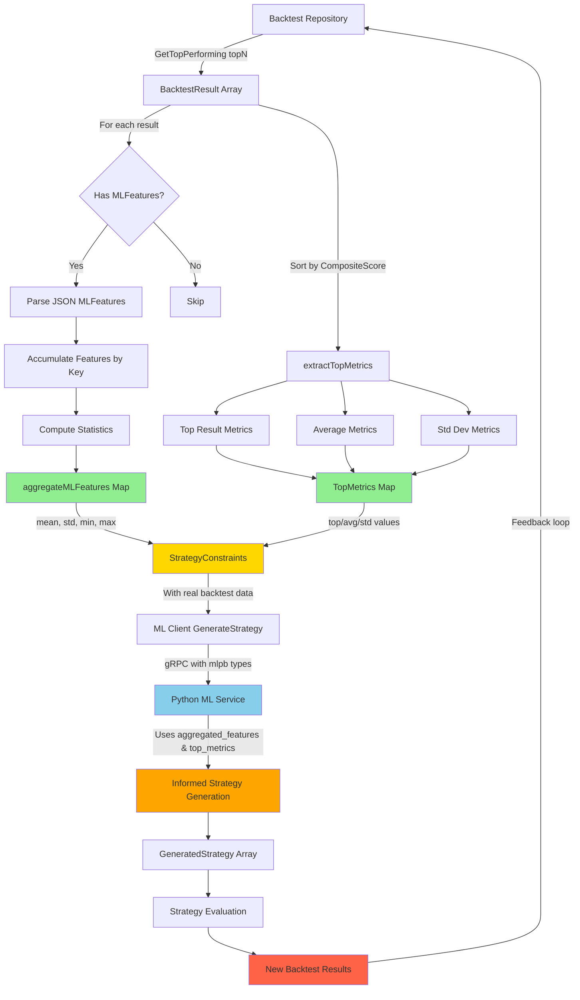

# Backtest Feature Aggregation Data Flow

## Input: BacktestResult Structure
```json
{
  "id": "uuid",
  "strategy_id": "uuid",
  "composite_score": 0.85,
  "sharpe_ratio": 1.80,
  "total_return": 0.35,
  "win_rate": 0.70,
  "max_drawdown": 0.10,
  "profit_factor": 2.5,
  "ml_features": {
    "market_volatility": 0.25,
    "liquidity": 0.75,
    "trend_strength": 0.55,
    "price_momentum": 0.62
  }
}
```

## Processing Steps

### 1. aggregateMLFeatures()
**Input**: `[]*models.BacktestResult` (e.g., 10 results)

**Processing**:
```go
for each result {
    if result.MLFeatures exists {
        unmarshal JSON to map[string]float64
        for each feature {
            accumulate values in allFeatures[key]
        }
    }
}

for each feature key {
    compute mean = sum(values) / count
    compute std = sqrt(variance)
    find min, max
    
    output[key+"_mean"] = mean
    output[key+"_std"] = std
    output[key+"_min"] = min
    output[key+"_max"] = max
}
```

**Output**: `map[string]float64` (e.g., 16 metrics for 4 base features)
```json
{
  "market_volatility_mean": 0.20,
  "market_volatility_std": 0.05,
  "market_volatility_min": 0.15,
  "market_volatility_max": 0.25,
  "liquidity_mean": 0.80,
  "liquidity_std": 0.05,
  "liquidity_min": 0.75,
  "liquidity_max": 0.85,
  "trend_strength_mean": 0.60,
  "trend_strength_std": 0.05,
  "trend_strength_min": 0.55,
  "trend_strength_max": 0.65,
  "price_momentum_mean": 0.63,
  "price_momentum_std": 0.03,
  "price_momentum_min": 0.60,
  "price_momentum_max": 0.66
}
```

### 2. extractTopMetrics()
**Input**: `[]*models.BacktestResult` (same 10 results)

**Processing**:
```go
sort results by composite_score DESC
top = results[0]

metrics = {
    "top_composite_score": top.CompositeScore,
    "top_sharpe_ratio": top.SharpeRatio,
    "top_roi": top.TotalReturn,
    "top_win_rate": top.WinRate,
    "top_max_drawdown": top.MaxDrawdown,
    "top_profit_factor": top.ProfitFactor
}

compute averages across all results
metrics["avg_sharpe_ratio"] = mean(results.SharpeRatio)
metrics["avg_roi"] = mean(results.TotalReturn)
...

compute standard deviations
metrics["std_sharpe_ratio"] = stddev(results.SharpeRatio)
metrics["std_roi"] = stddev(results.TotalReturn)
```

**Output**: `map[string]float64` (13 metrics)
```json
{
  "top_composite_score": 0.85,
  "top_sharpe_ratio": 1.80,
  "top_roi": 0.35,
  "top_win_rate": 0.70,
  "top_max_drawdown": 0.10,
  "top_profit_factor": 2.5,
  "avg_composite_score": 0.78,
  "avg_sharpe_ratio": 1.63,
  "avg_roi": 0.30,
  "avg_win_rate": 0.67,
  "avg_max_drawdown": 0.11,
  "std_sharpe_ratio": 0.12,
  "std_roi": 0.04
}
```

### 3. gRPC Transmission
**Proto Message**: `StrategyGenerationRequest`
```protobuf
message StrategyGenerationRequest {
  string risk_level = 1;
  double target_return = 2;
  double max_drawdown_limit = 3;
  double min_win_rate = 4;
  int32 max_candidates = 5;
  map<string, double> aggregated_features = 6;  // NEW
  map<string, double> top_metrics = 7;          // NEW
}
```

**Go Code**:
```go
req := &mlpb.StrategyGenerationRequest{
    RiskLevel:          constraints.RiskLevel,
    TargetReturn:       constraints.TargetReturn,
    MaxDrawdownLimit:   constraints.MaxDrawdownLimit,
    MinWinRate:         constraints.MinWinRate,
    MaxCandidates:      int32(constraints.MaxCandidates),
    AggregatedFeatures: aggregatedFeatures,  // 16 metrics
    TopMetrics:         topMetrics,          // 13 metrics
}
resp, err := c.client.GenerateStrategy(ctx, req)
```

**Python ML Service**:
```python
def GenerateStrategy(self, request, context):
    # Access real backtest data
    agg_features = dict(request.aggregated_features)
    top_metrics = dict(request.top_metrics)
    
    # Use in ML model
    model_input = {
        'risk_level': request.risk_level,
        'market_volatility': agg_features.get('market_volatility_mean'),
        'top_sharpe': top_metrics.get('top_sharpe_ratio'),
        'avg_roi': top_metrics.get('avg_roi'),
        # ... etc
    }
    
    # Generate informed strategies
    strategies = ml_model.predict(model_input)
    return StrategyGenerationResponse(strategies=strategies)
```

## Statistics Explained

### Mean (Average)
```
mean = (x₁ + x₂ + ... + xₙ) / n
```
**Purpose**: Central tendency of feature values across backtests

### Standard Deviation
```
std = sqrt(Σ(xᵢ - mean)² / (n-1))
```
**Purpose**: Variability/consistency of feature values

### Min/Max
```
min = minimum(x₁, x₂, ..., xₙ)
max = maximum(x₁, x₂, ..., xₙ)
```
**Purpose**: Range of feature values observed

## Example Use Case

**Scenario**: 10 strategies backtested over last 6 months

**Backtest Results**:
- 3 excellent performers (composite > 0.80)
- 5 good performers (composite > 0.60)
- 2 poor performers (composite < 0.50)

**aggregateMLFeatures Output**:
- Shows average market conditions across all backtests
- Reveals feature variance (std) indicating stable vs volatile markets
- Min/max shows full range of market scenarios tested

**extractTopMetrics Output**:
- Top 3 metrics show what peak performance looks like
- Averages show realistic expected performance
- Std shows consistency (low std = reliable, high std = risky)

**ML Service Decision**:
- "Generate strategies optimized for market_volatility_mean=0.20"
- "Target sharpe ratio between avg (1.63) and top (1.80)"
- "Consider std_roi=0.04 shows strategies are consistent"
- "Avoid features near min values (poor performance zone)"

## Benefits

1. **Data-Driven**: ML sees real performance, not synthetic guesses
2. **Statistical Rigor**: Mean/std provide confidence intervals
3. **Risk Awareness**: Max drawdown and variance inform risk models
4. **Optimization Target**: Top metrics set achievable performance goals
5. **Feedback Loop**: New strategies → backtest → aggregate → improve
