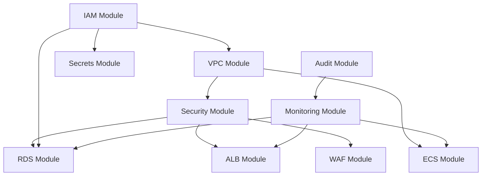

# Terraform Infrastructure

This directory contains the foundational AWS infrastructure for Clever Better. The focus is on networking, security, IAM, and secrets management to support later compute and data tiers.

## Module Overview
- VPC: Network foundation (public, private app, private data subnets)
- Security: Security groups for ALB, ECS, RDS, VPC endpoints
- WAF: Web ACL, rate limiting, managed rule sets, logging
- IAM: Roles and least-privilege policies for ECS and services
- Secrets: Secrets Manager and KMS for credentials
- RDS: PostgreSQL 15 with TimescaleDB, Multi-AZ, encrypted storage
- ECS: Fargate cluster with container insights
- ALB: Application Load Balancer with HTTPS and health checks
- Audit: CloudTrail and GuardDuty for compliance and threat detection
- Monitoring: Operational alarms and application log groups

## Environments
Each environment has its own configuration:
- terraform/environments/dev
- terraform/environments/staging
- terraform/environments/production

## Backend Initialization
1) Create backend resources with scripts:
   - terraform/scripts/setup-backend.sh
2) Copy backend.tf.example to backend.tf
3) Run terraform init in the environment directory

## Deployment Workflow
1) Configure terraform.tfvars (from terraform.tfvars.example)
2) terraform init
3) terraform validate
4) terraform plan
5) terraform apply

## Prerequisites
- AWS account with appropriate permissions
- ACM certificate for HTTPS (must be created before running Terraform)
- Terraform >= 1.5.0
- AWS CLI configured

## Variable Conventions
- Use environment-specific tfvars
- Prefer explicit naming and documented defaults
- All modules accept tags map for standardization

## Security Considerations
- Least-privilege IAM roles
- WAF protections with managed rule sets
- Secrets Manager for credentials
- VPC Flow Logs and CloudTrail for audit

## Module Dependency Graph

## Post-Deployment Steps
- Connect to RDS and install TimescaleDB extension: `CREATE EXTENSION IF NOT EXISTS timescaledb;`
- Run database migrations from `migrations/` directory
- Configure DNS (Route53 or external) to point to ALB DNS name
- Verify GuardDuty is detecting threats (test with sample findings)
