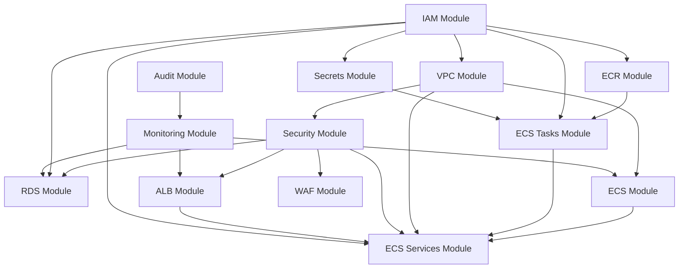

# Terraform Infrastructure

This directory contains the foundational AWS infrastructure for Clever Better. The focus is on networking, security, IAM, secrets management, and container orchestration to support the trading bot and ML services.

## Module Overview

### Core Infrastructure
- **VPC**: Network foundation (public, private app, private data subnets)
- **Security**: Security groups for ALB, ECS, RDS, VPC endpoints
- **WAF**: Web ACL, rate limiting, managed rule sets, logging
- **IAM**: Roles and least-privilege policies for ECS and services
- **Secrets**: Secrets Manager and KMS for credentials

### Data Tier
- **RDS**: PostgreSQL 15 with TimescaleDB, Multi-AZ, encrypted storage

### Compute Tier
- **ECS**: Fargate cluster with container insights
- **ECR**: Container registry with lifecycle policies
- **ECS Tasks**: Task definitions for bot, ML service, data ingestion
- **ECS Services**: Service definitions with auto-scaling

### Networking & Edge
- **ALB**: Application Load Balancer with HTTPS and health checks

### Operations
- **Audit**: CloudTrail and GuardDuty for compliance and threat detection
- **Monitoring**: Operational alarms and application log groups

## Environments

Each environment has its own configuration:
- `terraform/environments/dev` - Development (Fargate Spot, lower resources)
- `terraform/environments/staging` - Staging (production-like config)
- `terraform/environments/production` - Production (high availability)

## Backend Initialization

1. Create backend resources:
   ```bash
   ./terraform/scripts/setup-backend.sh
   ```
2. Uncomment the backend block in main.tf
3. Run terraform init in the environment directory

## Deployment Workflow

1. Configure terraform.tfvars (from terraform.tfvars.example)
2. `terraform init`
3. `terraform validate`
4. `terraform plan`
5. `terraform apply`

For container deployments, see [DEPLOYMENT_GUIDE.md](DEPLOYMENT_GUIDE.md).

## Quick Start

```bash
# Setup backend
./terraform/scripts/setup-backend.sh

# Initialize dev environment
cd terraform/environments/dev
cp terraform.tfvars.example terraform.tfvars
# Edit terraform.tfvars

terraform init
terraform plan
terraform apply
```

## Prerequisites

- AWS account with appropriate permissions
- ACM certificate for HTTPS (must be created before running Terraform)
- Terraform >= 1.5.0
- AWS CLI configured
- Docker (for container deployments)

## Variable Conventions

- Use environment-specific tfvars
- Prefer explicit naming and documented defaults
- All modules accept tags map for standardization

## Security Considerations

- Least-privilege IAM roles
- WAF protections with managed rule sets
- Secrets Manager for credentials
- VPC Flow Logs and CloudTrail for audit
- Immutable container images in production

## Module Dependency Graph



## Container Deployment

### ECR Repositories
- `clever-better-{env}-bot`
- `clever-better-{env}-ml-service`
- `clever-better-{env}-data-ingestion`

### Deploy Services
```bash
# Deploy all services
make deploy-dev TAG=latest

# Deploy specific service
make deploy-service ENV=staging SERVICE=bot TAG=v1.0.0

# Rollback
make rollback-dev SERVICE=bot
```

See [DEPLOYMENT_GUIDE.md](DEPLOYMENT_GUIDE.md) for complete deployment procedures.

## Post-Deployment Steps

1. Connect to RDS and install TimescaleDB extension:
   ```sql
   CREATE EXTENSION IF NOT EXISTS timescaledb;
   ```

2. Run database migrations from `migrations/` directory

3. Configure DNS (Route53 or external) to point to ALB DNS name

4. Build and push container images:
   ```bash
   make ecr-login
   make ecr-push-all ENV=dev TAG=latest
   ```

5. Verify deployment:
   ```bash
   make validate-dev
   ```

6. Verify GuardDuty is detecting threats (test with sample findings)

## Resource Allocation by Environment

| Resource | Dev | Staging | Production |
|----------|-----|---------|------------|
| **Bot Service** |
| CPU | 512 | 512 | 1024 |
| Memory | 1024 MB | 1024 MB | 2048 MB |
| Min/Max Tasks | 1/2 | 1/3 | 2/5 |
| **ML Service** |
| CPU | 1024 | 1024 | 2048 |
| Memory | 2048 MB | 2048 MB | 4096 MB |
| Min/Max Tasks | 1/3 | 1/5 | 2/10 |
| **Features** |
| Fargate Spot | Yes | No | No |
| ECS Exec | Yes | Yes | No |
| Image Mutability | Mutable | Mutable | Immutable |
